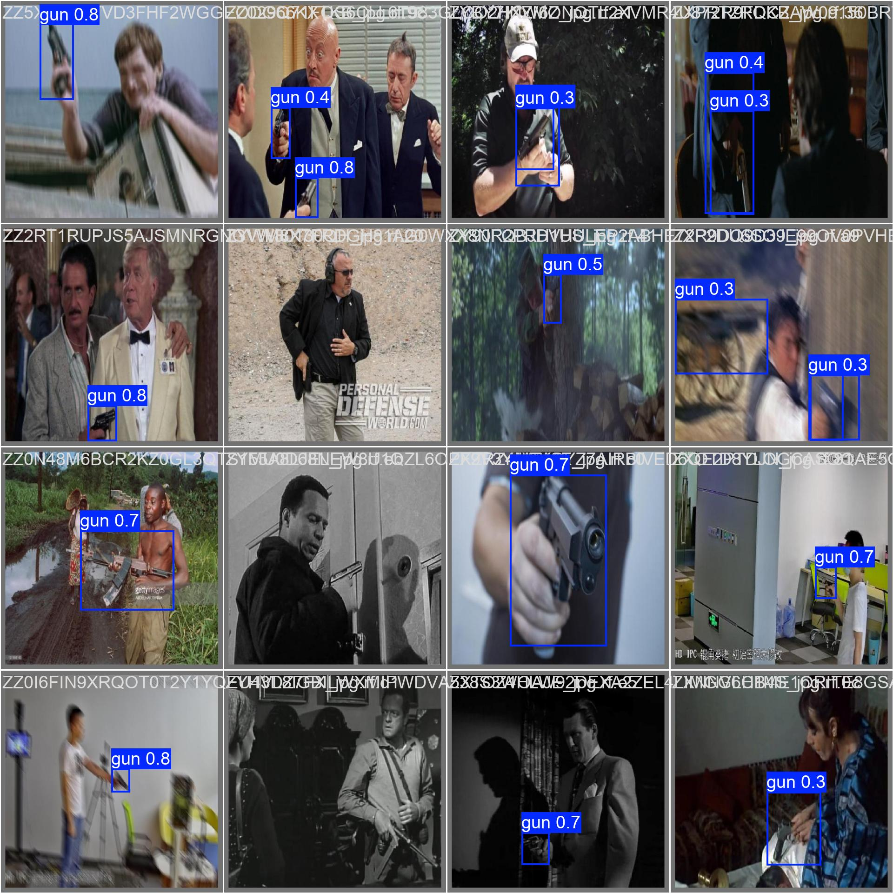
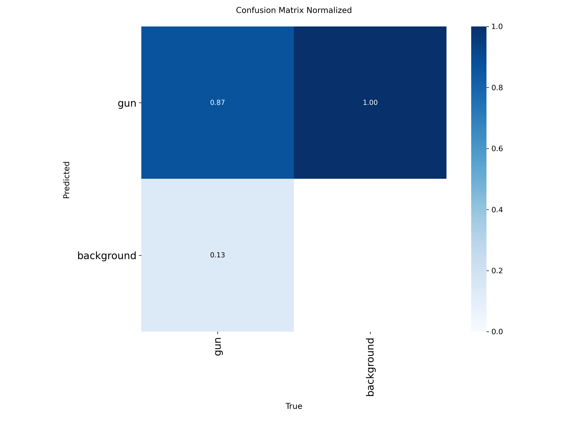
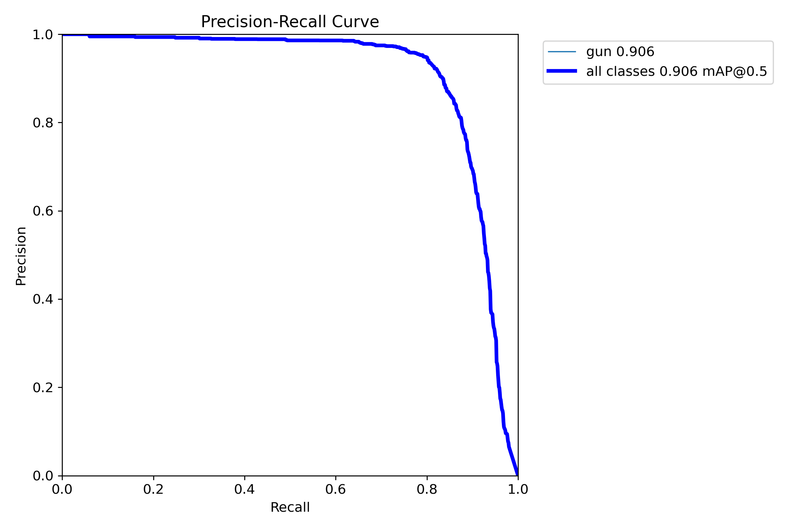

# 🔫 Weapon Detection System using YOLOv8

## Project Description

This project implements an advanced **weapon detection system** using YOLOv8 deep learning architecture for real-time security applications. The system is designed to automatically identify and locate weapons (specifically guns) in video streams and static images, providing critical security monitoring capabilities.

### Security Application Objectives

- **🎯 Real-time Threat Detection**: Automatically detect weapons in live video feeds from security cameras
- **🚨 Alert System**: Provide immediate threat level assessments (SAFE/LOW/MEDIUM/HIGH)
- **📹 Video Surveillance**: Process recorded video footage for forensic analysis
- **🏢 Public Safety**: Monitor high-security areas like airports, schools, and government buildings
- **⚡ Fast Response**: Enable rapid response times for security personnel
- **📊 Analytics**: Generate detection statistics and threat assessment reports

## 📈 Weapon Detection Accuracy Metrics

### Final Model Performance (After 30 Epochs)
- **Precision**: 90.6%
- **Recall**: 82.7%
- **mAP@0.5**: 90.4%
- **mAP@0.5-0.95**: 54.8%

### Training Progress
| Metric | Initial (Epoch 1) | Final (Epoch 30) | Improvement |
|--------|-------------------|------------------|-------------|
| Precision | 62.6% | 90.6% | +28.0% |
| Recall | 45.5% | 82.7% | +37.2% |
| mAP@0.5 | 51.0% | 90.4% | +39.4% |
| mAP@0.5-0.95 | 25.4% | 54.8% | +29.4% |

### Dataset Statistics
- **Total Classes**: 1 (Gun)
- **Training Images**: ~2,000+ images
- **Validation Images**: ~500+ images
- **Test Images**: ~200+ images
- **Data Source**: Roboflow Weapon Detection Dataset v3

## 🖼️ Screenshots

### F1 Curve:

*Sample training batch showing ground truth annotations*

### Validation Results

*Model predictions on validation set*

### Confusion Matrix

*Model performance confusion matrix*

### Performance Curves

*Precision-Recall curve showing model performance*

### Video Detection Example


## 🛠️ Installation

### Prerequisites
- Python 3.8+
- CUDA-capable GPU (recommended)
- 8GB+ RAM

### Step 1: Clone Repository
```bash
git clone <repository-url>
cd weapon-detection-system
```

### Step 2: Create Virtual Environment
```bash
python -m venv yolov8-env
# Windows
yolov8-env\Scripts\activate
# Linux/Mac
source yolov8-env/bin/activate
```

### Step 3: Install Dependencies
```bash
pip install ultralytics
pip install opencv-python
pip install numpy
pip install torch torchvision torchaudio
```

### Step 4: Download Pre-trained Model
The trained model weights are located at:
```
./yolov8n_results2/weights/best.pt
```

## 🚀 Running Scripts

### 1. Video Detection
Detect weapons in video files:

```bash
# Basic usage
python detect_video.py

# With custom parameters
python detect_video.py --model ./yolov8n_results2/weights/best.pt --source ./video.mp4 --save-video --show

# Real-time webcam detection
python detect_video.py --source 0 --show
```

**Parameters:**
- `--model`: Path to trained model weights
- `--source`: Video file path or webcam index (0 for default camera)
- `--output`: Output directory (default: 'results')
- `--conf`: Confidence threshold (default: 0.25)
- `--show`: Display video window during processing
- `--save-video`: Save processed video with detections

### 2. Model Validation
Validate model performance on test dataset:

```bash
python validate.py
```

**Output:**
```
Validating model ./yolov8n_results2/weights/best.pt on dataset ./Weapon.v3i.yolov8/data.yaml ...

Validation Metrics:
mAP@0.5: 0.904
mAP@0.5-0.95: 0.548
Precision: 0.906
Recall: 0.827
```

### 3. Training (if needed)
To retrain the model:

```bash
# Basic training
yolo detect train data=./Weapon.v3i.yolov8/data.yaml model=yolov8n.pt epochs=30

# Advanced training with custom parameters
yolo detect train data=./Weapon.v3i.yolov8/data.yaml model=yolov8n.pt epochs=50 imgsz=640 batch=16
```

## 📁 Project Structure

```
weapon-detection-system/
├── README.md
├── detect_video.py          # Main video detection script
├── validate.py              # Model validation script
├── yolov8n_results2/        # Training results
│   ├── weights/
│   │   ├── best.pt          # Best model weights
│   │   └── last.pt          # Last epoch weights
│   ├── results.csv          # Training metrics
│   └── train_batch*.jpg     # Training visualizations
├── Weapon.v3i.yolov8/       # Dataset
│   ├── data.yaml            # Dataset configuration
│   ├── train/               # Training images & labels
│   ├── valid/               # Validation images & labels
│   └── test/                # Test images & labels
├── results/                 # Output directory
├── runs/                    # Validation results
└── yolov8-env/             # Virtual environment
```

## 🎮 Usage Controls

### During Video Playback:
- **'q'**: Quit the application
- **'s'**: Save screenshot of current frame
- **ESC**: Exit fullscreen mode

### Threat Levels:
- 🟢 **SAFE**: No weapons detected
- 🟡 **LOW**: Weapon detected with low confidence
- 🟠 **MEDIUM**: Weapon detected with medium confidence
- 🔴 **HIGH**: Weapon detected with high confidence

## 📊 Output Files

### Processed Videos
- **Location**: `results/detected_YYYYMMDD_HHMMSS.mp4`
- **Features**: Bounding boxes, confidence scores, threat levels, timestamps

### Screenshots
- **Location**: `results/screenshot_XXXXXX.jpg`
- **Trigger**: Press 's' during video playback

### Detection Logs
```
[INFO] Starting detection...
[ALERT] Frame 1234: HIGH - gun
[INFO] Progress: 45.2% (1234/2730)
[SUMMARY]
  Frames processed: 2730
  Weapon detections: 15
  Processing time: 68.45 seconds
  Average FPS: 39.89
  Detection rate: 0.005
```

## ⚠️ Important Notes

1. **Model Accuracy**: The model achieves 90.4% mAP@0.5, making it suitable for security applications
2. **False Positives**: Always verify detections before taking action
3. **Privacy**: Ensure compliance with local privacy laws when deploying
4. **Performance**: GPU acceleration recommended for real-time processing
5. **Updates**: Regularly retrain the model with new data for improved accuracy

## 🔧 Troubleshooting

### Common Issues:

1. **"Model not found" Error**:
   ```bash
   # Ensure model path is correct
   python detect_video.py --model ./yolov8n_results2/weights/best.pt
   ```

2. **"Cannot open video" Error**:
   ```bash
   # Check video file path
   python detect_video.py --source ./your_video.mp4
   ```

3. **Slow Processing**:
   - Use GPU acceleration if available
   - Reduce video resolution
   - Increase confidence threshold

## 📝 License

This project is for educational and security research purposes. Please ensure compliance with local laws and regulations when deploying in production environments.

## 🤝 Contributing

1. Fork the repository
2. Create a feature branch
3. Add improvements or fixes
4. Test thoroughly
5. Submit a pull request

## 📞 Support

For issues and questions:
- Check the troubleshooting section
- Review YOLOv8 documentation
- Open an issue in the repository

---

**⚠️ Disclaimer**: This system is designed to assist security personnel and should not be the sole basis for security decisions. Always verify detections and follow proper security protocols.
